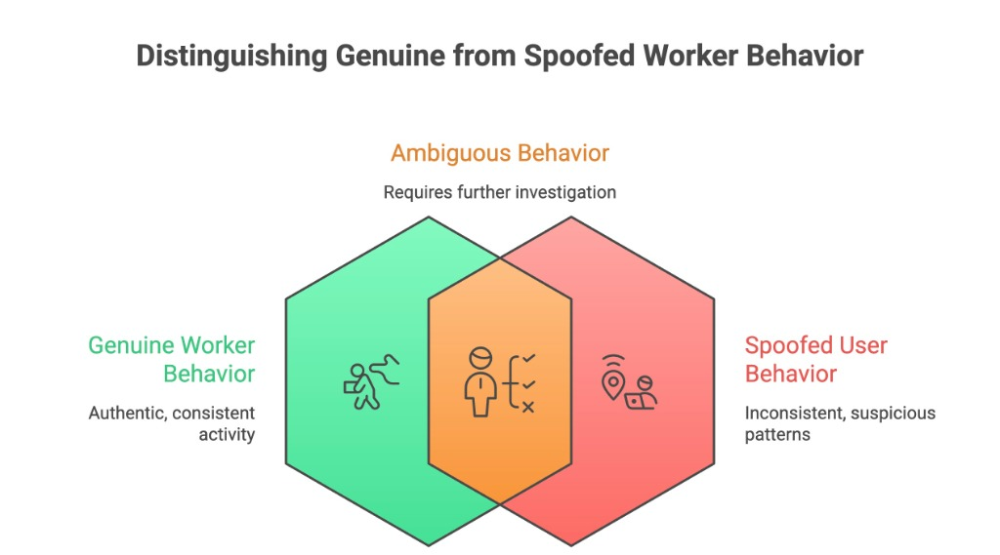
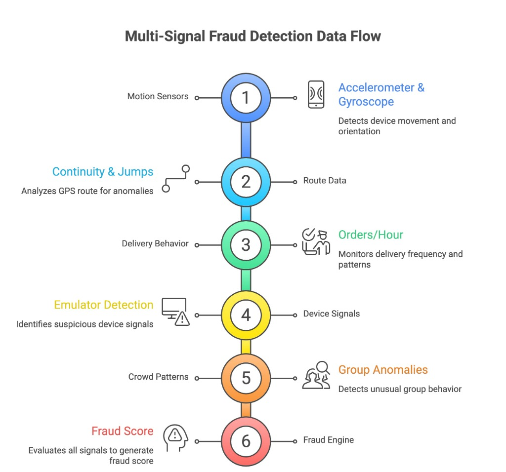
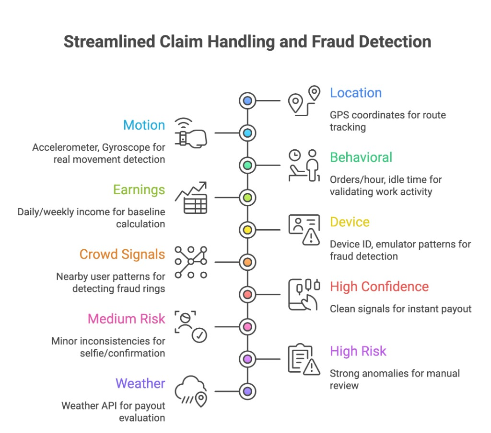
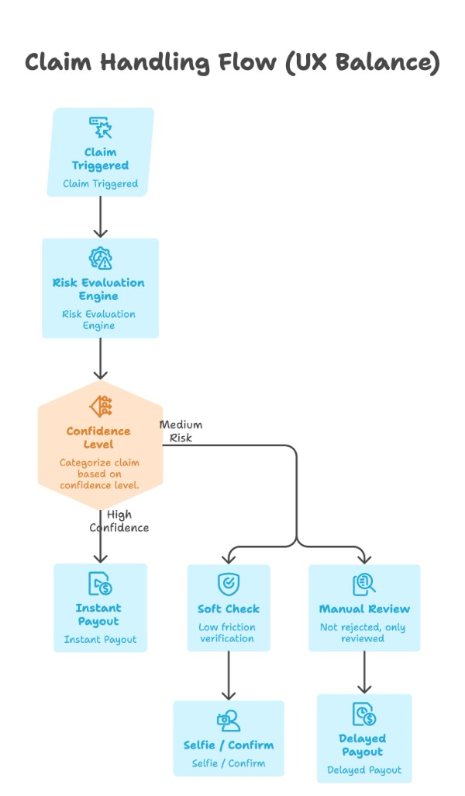
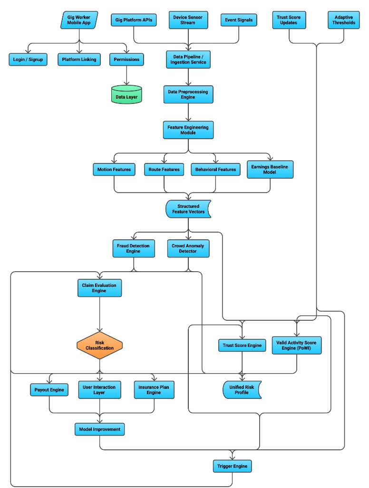

<div align="center">

# Rozgaar Raksha

### **Proof-of-Work Insurance for Gig Workers**

[](LICENSE)
[](#)
[](#ai--ml-architecture)
[](#)

*"Unlike traditional systems, we don't just verify location — we verify behavior, making GPS spoofing attacks economically unviable."*

---

</div>

## Table of Contents

- [Problem Statement](#problem-statement)
- [Solution](#solution)
- [Core Innovation: Proof-of-Work Insurance (PoWI)](#core-innovation-proof-of-work-insurance-powi)
- [Target Users — Deep Persona](#target-users--deep-persona)
- [System Overview — How It Works](#system-overview--how-it-works)
- [Market Crash Handling](#market-crash-handling--critical-scenario)
- [Adversarial Defense & Anti-Spoofing Strategy](#adversarial-defense--anti-spoofing-strategy)
- [AI / ML Architecture](#ai--ml-architecture)
- [Technical Architecture](#technical-architecture)
- [Reputation-Based Pricing](#reputation-based-pricing)
- [Payout Logic](#final-payout-logic)
- [Why Rozgaar Raksha Wins](#why-rozgaar-raksha-wins)
- [Future Scope](#future-scope)

---

## Problem Statement

Gig workers across platforms like **Blinkit**, **Swiggy**, **Zomato**, and **Zepto** face a harsh reality — their income is inherently unpredictable and unprotected.

### The core issues:

| Challenge | Description |
|:---|:---|
| **Weather Disruptions** | Heavy rain, storms, and extreme heat directly reduce orders and earning potential |
| **Demand Fluctuations** | Sudden dips in customer demand leave workers idle despite being active |
| **Platform Outages** | App crashes, server downtime, and technical failures cut off earnings entirely |
| **No Income Safety Net** | No structured system exists to protect workers from income loss during these events |

### What's wrong with existing solutions?

Existing parametric insurance models fall short because they:

- Depend **only on external triggers** (e.g., weather data, time of day) to determine payouts
- Completely **ignore actual worker activity** — a worker sitting at home gets the same treatment as one actively on the road
- Are **vulnerable to GPS spoofing and fraud**, leading to massive payout leakage
- Offer **no personalization** — every worker gets the same plan regardless of their risk profile

> **Rozgaar Raksha was built to solve exactly this — a system that protects real workers, based on real activity, with real fraud resistance.**

---

## Solution

**Rozgaar Raksha** is a platform that provides **personalized, activity-verified insurance** for gig workers. It fundamentally rethinks how income protection should work in the gig economy.

### How it works at a high level:

```
┌──────────────────┐      ┌──────────────────┐      ┌──────────────────┐
│   Connect Gig    │ ──▶  │  Analyze Worker  │ ──▶  │  Offer Weekly    │
│   Platforms      │      │  Activity & Risk │      │  Insurance Plans │
└──────────────────┘      └──────────────────┘      └──────────────────┘
                                                            │
                                                            ▼
┌──────────────────┐      ┌──────────────────┐      ┌──────────────────┐
│   Trigger-Based  │ ◀──  │  Real-Time       │ ◀──  │  Monitor Work    │
│   Payouts        │      │  PoWI Validation │      │  Activity        │
└──────────────────┘      └──────────────────┘      └──────────────────┘
```

**Rozgaar Raksha:**
- **Connects** with gig platforms to aggregate worker data
- **Analyzes** earnings history, behavioral patterns, and activity signals
- **Offers** personalized weekly insurance plans based on individual risk profiles
- **Ensures** payouts are issued only when **real work activity is verified** through our Proof-of-Work system

---

## Core Innovation: Proof-of-Work Insurance (PoWI)

This is what sets Rozgaar Raksha apart from every other solution in the market.

> **Traditional systems trust location. Rozgaar Raksha trusts behavior consistency.**

A worker is eligible for payout **only if** their activity passes a multi-signal validation check:

```
Valid Activity Score = Location Consistency
                    + Motion Pattern Match
                    + Delivery Behavior Signals
```

| Component | What It Measures | Why It Matters |
|:---|:---|:---|
| **Location Consistency** | GPS trajectory follows realistic routes | Catches fake/static GPS coordinates |
| **Motion Pattern** | Accelerometer & gyroscope match real-world movement | Detects stationary devices with spoofed location |
| **Delivery Behavior** | Orders/hour, pickup-drop clustering, idle patterns | Validates genuine work activity vs. idle claims |

**If the score falls below a dynamic threshold → the claim is flagged for review.**

> **This makes GPS spoofing economically unviable.** An attacker would need to simulate realistic motion, logical routes, AND genuine delivery patterns simultaneously — a cost that exceeds the payout benefit.

---

## Target Users — Deep Persona

Our users are **not** just "delivery partners." They are individuals navigating a highly volatile and demanding work environment.

### Who they are:

| Characteristic | Reality |
|:---|:---|
| **Income-unstable** | Earnings vary wildly week to week — no guaranteed paycheck |
| **Incentive-driven** | Platform bonuses and surge pricing heavily influence behavior |
| **Time-sensitive** | Every minute counts — delays directly reduce earnings |
| **Platform-dependent** | Locked into platform ecosystems with little control over rules |

### What this implies for product design:

| User Expectation | Rozgaar Raksha's Response |
|:---|:---|
| **Instant payouts** | Claims processed and paid within minutes, not days |
| **No complex verification** | Minimal-friction validation; no lengthy forms or paperwork |
| **System may be exploited** | Built-in anti-fraud from day one, not an afterthought |
| **Trust is everything** | Transparent scoring; workers can see why a decision was made |

### Design principles:

- **Minimize friction** — onboarding takes minutes, not hours
- **Maximize trust** — every decision is explainable  
- **Prevent exploitation** — without ever harming genuine workers

---

## System Overview — How It Works

Rozgaar Raksha operates through a **7-stage pipeline**, from onboarding to payout delivery.

### Stage 1: Onboarding

The worker signs up and links their gig platform accounts:

- **Signup / Login** via phone number + OTP
- **Link gig platforms** — Blinkit, Swiggy, Zomato, Zepto, etc.
- **Grant permissions:**
  - GPS access (for location verification)
  - Activity data (order history, ratings)
  - Camera (optional — for selfie verification in medium-risk claims)

---

### Stage 2: Data Aggregation

We pull and structure comprehensive data from linked platforms:

| Data Type | Details |
|:---|:---|
| **Order History** | Total orders, completion rate, cancellation rate |
| **Ratings** | Customer and platform ratings over time |
| **Active Hours** | Daily, weekly, and monthly active work hours |
| **Earnings** | Daily, weekly, monthly, and yearly income breakdown |

---

### Stage 3: Smart Insights

From raw data, we compute:

- **Expected earnings baseline** — what a worker should earn under normal conditions
- **Work patterns** — peak hours, preferred zones, consistency metrics
- **Risk exposure** — likelihood of income disruption based on history and external factors

---

### Stage 4: Personalized Insurance Plans

Based on insights, we generate **weekly insurance plans** with dynamic pricing:

| Pricing Factor | Impact on Premium |
|:---|:---|
| **Earnings History** | Higher consistent earnings → lower premium |
| **Activity Level** | More active workers → better rates |
| **Trust Score** | Good behavioral history → significant discounts |

---

### Stage 5: Real-Time Monitoring

While the worker is active, we continuously monitor:

- **GPS tracking** — route continuity and location realism
- **Motion tracking** — accelerometer and gyroscope data for real movement detection
- **Behavioral signals** — orders per hour, idle times, pickup/drop patterns

---

### Stage 6: Trigger Events

A payout evaluation is **automatically triggered** when the system detects:

- **Heavy rain / severe weather** in the worker's active zone
- **Demand crash** — orders per hour drop significantly below area baseline
- **Platform downtime** — confirmed service outage affecting the platform

---

### Stage 7: Proof-of-Work Validation

Before any payout is issued, the system asks two critical questions:

1. **Was the worker actually active?** — Validated through GPS, motion, and behavioral data
2. **Does the behavior match real delivery work?** — Cross-checked against historical patterns

> Only workers who pass both checks receive their payout. This is the **PoWI gate**.

---

## Market Crash Handling — Critical Scenario

Rozgaar Raksha goes **far beyond weather-based triggers**. We handle the scenarios that other insurance products completely ignore.

### The problem:

During low-demand periods, economic slowdowns, or platform outages, gig workers experience:

| Scenario | Impact on Worker |
|:---|:---|
| **Low demand periods** | Zero or minimal orders despite being actively available |
| **Economic slowdowns** | Reduced consumer spending leads to fewer orders platform-wide |
| **Platform outages** | Technical failures completely cut off order flow |

The worker is **online, active, and ready** — but earns nothing. No existing insurance product covers this.

### Our approach:

Rozgaar Raksha detects market crashes through:

- **Drop in orders/hour** below the area's historical baseline
- **Area-wide inactivity** — when multiple workers in the same zone report low activity
- **Platform-level anomalies** — API response patterns and order flow disruptions

### Payout logic:

```
IF  worker is active (validated via PoWI)
AND earnings fall below expected baseline
──────────────────────────────────────────
THEN → Payout is triggered
```

### Why this matters:

- Covers **real-world income instability**, not just weather events
- Expands protection to **demand-based disruptions** that workers can't control
- Makes Rozgaar Raksha a true **income protection system**, not just parametric insurance

---

## Adversarial Defense & Anti-Spoofing Strategy

Rozgaar Raksha is **architected from the ground up** to resist spoofing, fraud, and coordinated attacks. Security is not a feature — it's a foundation.

### 1. Core Philosophy: Behavior Over Location

We do **not** rely on GPS alone. We validate the full spectrum of worker behavior:

<div align="center">



*Figure 1: Behavior classification — Genuine vs. Spoofed vs. Ambiguous worker patterns*

</div>

| Signal | Genuine Worker | Attacker |
|:---|:---|:---|
| **Motion** | Continuous, natural movement | Fake GPS movement, no physical motion |
| **Routes** | Logical, realistic paths | Random teleportation, abrupt jumps |
| **Delivery Pattern** | Consistent pickup → delivery flow | Irregular, non-sequential behavior |
| **Device** | Real device, stable fingerprint | Emulator, multi-location abuse |

---

### 2. Multi-Signal Fraud Detection Pipeline

Rozgaar Raksha uses **6 independent signal layers** to build a comprehensive fraud score:

<div align="center">



*Figure 2: The 6-layer fraud detection pipeline — from motion sensors to final fraud score*

</div>

#### A. Motion Sensors
- **Accelerometer + Gyroscope** data from the device
- Detects real physical movement vs. a static device with spoofed GPS

#### B. Route Continuity
- Analyzes GPS trajectories for **smooth vs. abrupt** transitions
- Validates **distance-time realism** — you can't teleport 5 km in 2 seconds

#### C. Delivery Behavior
- **Orders per hour** — does the rate match their historical pattern?
- **Pickup/drop clustering** — are locations realistic and varied?
- **Idle inconsistencies** — unusual idle periods during "active" work

#### D. Device Fingerprinting
- **Emulator detection** — identifies virtual devices and rooted phones
- **Multi-location abuse** — flags the same device ID claiming from different cities

#### E. Crowd Anomaly Detection
- Detects **fraud rings**: multiple claims from the same zone with identical patterns
- Identifies **synchronized claim timing** — coordinated fraud attempts
- Flags **identical motion patterns** across different accounts

---

### 3. Streamlined Claim Handling

Our claim handling pipeline balances **fraud prevention with UX fairness**:

<div align="center">



*Figure 3: Complete claim handling pipeline — data signals, risk levels, and resolution paths*

</div>

<div align="center">



*Figure 4: UX-balanced claim flow — from trigger to payout decision*

</div>

| Confidence Level | Action | User Experience |
|:---|:---|:---|
| **High Confidence** | Instant payout | Zero friction — money in account within minutes |
| **Medium Risk** | Soft verification | Quick selfie or one-tap confirmation — 30 seconds |
| **High Risk** | Manual review | Delayed payout (never outright rejected) — reviewed within 24 hours |

> ### Core Principle
> **We prioritize false negatives over false positives.**  
> A genuine worker should **never** be denied income protection. If there's doubt, we lean toward paying out and learning from the case — not blocking the worker.

---

## AI / ML Architecture

Rozgaar Raksha uses a **hybrid decision engine** designed for long-term production reliability.

### Current Production Mode — Rules + Risk Intelligence

Current decisions combine deterministic rules with a model-ready risk proxy score:

```
Final Fraud Risk = 0.65 × Rule Risk + 0.35 × Model-Risk Proxy
```

The model-risk proxy currently uses engineered features (not a black-box model), such as:

- GPS anomaly signal
- motion confidence signal
- historical anomaly rate
- sudden output-drop signal

This keeps the system explainable while creating a direct path to trained models.

### Confidence-Band Decisions

| Band | Operational Action | Worker Experience |
|:---|:---|:---|
| **LOW** | Auto-settle claim | Instant payout |
| **MEDIUM** | Request lightweight evidence | Quick verification flow |
| **HIGH** | Manual review queue | Human-reviewed decision |

### Explainability by Design

Every claim decision returns:

- risk band
- reason codes
- rule-risk component
- model-risk component
- worker-facing message (English/Hindi)

### Long-Term ML Evolution Path

1. **Shadow mode:** train and score without impacting payouts.
2. **Assisted mode:** model influences only medium/high-risk routing.
3. **Adaptive mode:** periodic retraining with fairness and drift checks.

This roadmap avoids overpromising "AI-powered" behavior while still building toward robust ML-assisted operations.

---

## Technical Architecture

The full system architecture showing the end-to-end data flow:

<div align="center">



*Figure 5: Complete system architecture — from data ingestion to payout delivery*

</div>

### Architecture Layers

| Layer | Components | Function |
|:---|:---|:---|
| **Data Layer** | Gig Platform APIs, Device Sensor Stream, Event Signals | Raw data ingestion from all sources |
| **Processing Layer** | Data Pipeline, Preprocessing Engine, Feature Engineering | Cleans, transforms, and structures raw data |
| **Feature Layer** | Motion Features, Route Features, Behavioral Features, Earnings Baseline | Extracts meaningful signals for scoring |
| **Scoring Engine** | Valid Activity Score (PoWI), Fraud Score, Trust Score | Multi-dimensional risk evaluation |
| **Decision Engine** | Claim Evaluation, Risk Classification, Payout Decision | Final determination on claim validity |
| **Output Layer** | Insurance Plans, Alerts, Payouts, Model Improvement | User-facing results and feedback loops |

---

## Reputation-Based Pricing

Every worker has a dynamic **Trust Score** that directly influences their insurance premium.

```
Trust Score = f(behavioral_consistency, claim_history, activity_regularity, fraud_flags)
```

| Trust Level | Behavior | Premium Impact |
|:---|:---|:---|
| **High Trust** | Consistent work patterns, no fraud flags, regular activity | **Lowest premiums** — rewarded for reliability |
| **Medium Trust** | Some inconsistencies, new account, limited history | **Standard premiums** — building reputation |
| **Low Trust** | Suspicious activity, past flags, irregular patterns | **Higher premiums** — incentivized to improve |

> The system is designed to **reward good behavior over time**, creating a positive feedback loop where genuine workers get better rates the longer they use Rozgaar Raksha.

---

## Final Payout Logic

A payout is issued when **both conditions** are met:

```
                    ┌─────────────────────┐
                    │   TRIGGER EVENT     │
                    │   (Weather / Crash  │
                    │    / Outage)        │
                    └─────────┬───────────┘
                              │
                              ▼
                    ┌─────────────────────┐
                    │   PROOF-OF-WORK     │
                    │   VALIDATION        │
                    │   (Was worker       │
                    │    genuinely active?)│
                    └─────────┬───────────┘
                              │
                              ▼
              ┌───────────────────────────────┐
              │                               │
              │   Final Payout =              │
              │   Coverage Plan Amount        │
              │         ×                     │
              │   Validated Activity Score    │
              │                               │
              └───────────────────────────────┘
```

**Example:** If a worker has ₹500 coverage and a Validated Activity Score of 0.85, their payout = ₹500 × 0.85 = **₹425**

This ensures payouts are **proportional to actual verified effort**, not binary all-or-nothing decisions.

---

## Why Rozgaar Raksha Wins

| Feature | Traditional Insurance | Rozgaar Raksha |
|:---|:---|:---|
| **Trigger Model** | Weather only | Weather + Market Crash + Platform Outage |
| **Validation** | None or GPS-only | Multi-signal Proof-of-Work (PoWI) |
| **Fraud Detection** | Post-hoc investigation | Real-time, multi-layered, AI-driven |
| **Pricing** | One-size-fits-all | Dynamic, reputation-based, personalized |
| **Trust System** | None | Continuous trust scoring with rewards |
| **Payout Speed** | Days to weeks | Minutes (high confidence claims) |
| **Worker Experience** | Complex forms and paperwork | Frictionless, mobile-first, transparent |
| **Market Crash Coverage** | Not covered | Fully supported |
| **Coordinated Fraud Defense** | Not handled | Crowd anomaly detection |

---

## Future Scope

| Phase | Milestone | Description |
|:---|:---|:---|
| **Phase 1** | MVP Launch | Rule-based scoring, basic coverage, single city pilot |
| **Phase 2** | ML Integration | Isolation Forest, behavioral clustering, adaptive models |
| **Phase 3** | Insurance Partnerships | Collaboration with licensed insurance providers for regulatory compliance |
| **Phase 4** | National Rollout | Multi-city expansion across India's gig economy |
| **Phase 5** | Ecosystem Integration | Real-time adaptive pricing, cross-platform data sharing, international expansion |

---

<div align="center">

> *"Unlike traditional systems, we don't just verify location — we verify behavior, making GPS spoofing attacks economically unviable."*

---

**Built for the gig workers who keep our cities running.**

</div>